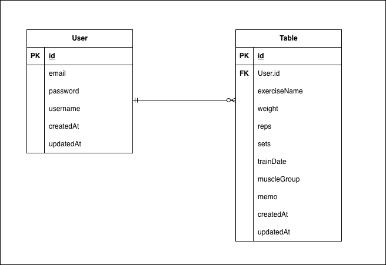

# Training App Portfolio

筋トレ記録アプリケーション

## 概要

Java + Spring Boot + React を使用した筋トレ記録アプリです。
ユーザーが日々の筋トレ記録を管理し、進捗を可視化できます。

JWT 認証によるセキュアな API、バリデーション、エラーハンドリング、
ユニットテスト・統合テストを実装し、実務を意識した設計を行いました。

## 技術スタック

### バックエンド（完成）
- **言語**：Java 25
- **フレームワーク**：Spring Boot 4.0.6
- **データベース**：PostgreSQL 16
- **認証**：Spring Security + JWT（JSON Web Token）
- **パスワードハッシュ化**：BCrypt
- **API ドキュメント**：Swagger（springdoc-openapi）
- **テスト**：JUnit 5・Mockito・H2 Database

### フロントエンド（実装予定）
- **ライブラリ**：React
- **スタイリング**：Tailwind CSS
- **チャート**：Recharts

## データベース設計

### ER図

### テーブル概要

| テーブル | 説明 |
|---------|------|
| users | ユーザー情報（メール・パスワード・ユーザー名） |
| training_records | 筋トレ記録（種目・重量・回数・セット数・日付など） |

User と TrainingRecord は 1対多の関係（1人のユーザーが複数の記録を持つ）

## 機能一覧

### 認証機能
- [x] ユーザー登録（パスワードはBCryptでハッシュ化）
- [x] ログイン（JWTトークン発行）
- [x] JWTトークンによるAPI認証
- [x] 未認証アクセス時の401エラー応答

### 筋トレ記録機能（CRUD）
- [x] 記録一覧取得（日付の新しい順）
- [x] 記録の詳細取得
- [x] 記録の新規作成
- [x] 記録の更新
- [x] 記録の削除
- [x] 自分以外のユーザーの記録にはアクセス不可（権限チェック）

### 品質・セキュリティ
- [x] 入力値バリデーション（Bean Validation）
- [x] エラーハンドリング（404・400・500の適切な応答）
- [x] レスポンスからパスワードを除外（@JsonIgnore）
- [x] ユニットテスト 6件（Service層）
- [x] 統合テスト 7件（Repository層・H2 Database使用）
- [x] Swagger API ドキュメント自動生成

### フロントエンド（実装予定）
- [ ] React フロントエンド
- [ ] ログイン・記録管理画面
- [ ] グラフ表示機能（Recharts）
- [ ] Docker 化
- [ ] Render へのデプロイ

## セットアップ方法

### 前提条件
- Java 25
- Maven 3.9 以上
- PostgreSQL 16 以上

### インストール手順

\`\`\`bash
# 1. リポジトリをクローン
git clone git@github.com:Takemura-dev/training-app-portfolio.git
cd training-app

# 2. PostgreSQL で training_app データベースを作成
psql -U postgres -c "CREATE DATABASE training_app;"

# 3. Spring Boot を起動
mvn spring-boot:run
\`\`\`

### 動作確認

\`\`\`bash
# Hello World 確認
curl http://localhost:8080/

# Swagger UI（API ドキュメント）
http://localhost:8080/swagger-ui/index.html
\`\`\`

### テスト実行

\`\`\`bash
mvn test
\`\`\`

## API エンドポイント

### 認証（認証不要）
| メソッド | パス | 説明 |
|---------|------|------|
| POST | /api/auth/register | ユーザー登録 |
| POST | /api/auth/login | ログイン（JWTトークン発行） |

### 筋トレ記録（JWT認証必須）
| メソッド | パス | 説明 |
|---------|------|------|
| GET | /api/records | 全記録取得 |
| GET | /api/records/{id} | 記録の詳細取得 |
| POST | /api/records | 記録作成 |
| PUT | /api/records/{id} | 記録更新 |
| DELETE | /api/records/{id} | 記録削除 |

認証が必要なエンドポイントには、以下のヘッダーが必要です。

\`\`\`
Authorization: Bearer {ログイン時に取得したJWTトークン}
\`\`\`

## アーキテクチャ

リクエストの流れを Controller → Service → Repository → DB の
4層構造に分離し、責務を明確にしています。

\`\`\`
Client
↓
Controller（リクエスト受付・レスポンス整形）
↓
Service（ビジネスロジック・権限チェック）
↓
Repository（DB操作）
↓
PostgreSQL
\`\`\`

JWT 認証は Spring Security のフィルターチェーンに組み込み、
リクエストごとに認証情報を検証してから Controller に到達する設計です。

## 開発進捗

| フェーズ | 期間 | 状態 |
|---------|------|------|
| 環境構築 | 6/9-6/11 | 完了 |
| バックエンド基本実装 | 6/17-6/23 | 完了 |
| CRUD完成・認証実装 | 6/24-6/30 | 完了 |
| テスト・リファクタリング | 7/1-7/7 | 完了 |
| フロントエンド | 7/8-7/14 | 予定中 |
| デプロイ | 7/15+ | 予定中 |

予定より前倒しでバックエンドが完成しています。

## 作成者

竹村　駿人（Takemura Hayato）
- GitHub: https://github.com/Takemura-dev

## ライセンス

MIT License